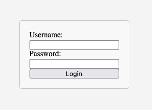

# Todo List App

This project is an application that allow user to login and see the todo list.

Enter the root page is a login form (composed with components `<LoginForm>` and `<LoginPage>`). User can login with default account:

```
Username: username
Password: password
```



After logged in, a todo list will be shown (composed with components `<TodoList>` and `<TodoListPage>`). The data type of todo is defined in `/src/types/types.ts`.


## Exercise 1: Complete Login Flow

Component under test: `/src/components/LoginForm.tsx`

Test file: `/src/components/LoginForm.test.tsx`

1. Correctly render the login form with input fields.
2. Simulate typing username and password; the input should be displayed correctly.
3. Clicking submit should call the login function.
4. On successful login, it should redirect to the `/todo` page.
5. On failed login, it should not redirect to the `/todo` page, and an error message should be output to the console.

## Exercise 2: Ensure Todo List Displays Correctly

Component under test: `/src/pages/TodoListPage.tsx`

Test file: `/src/pages/TodoListPage.test.tsx`

1. When the todo list is fetched successfully, the data content should be displayed correctly.
2. When fetching the todo list fails, an error message should be displayed.
